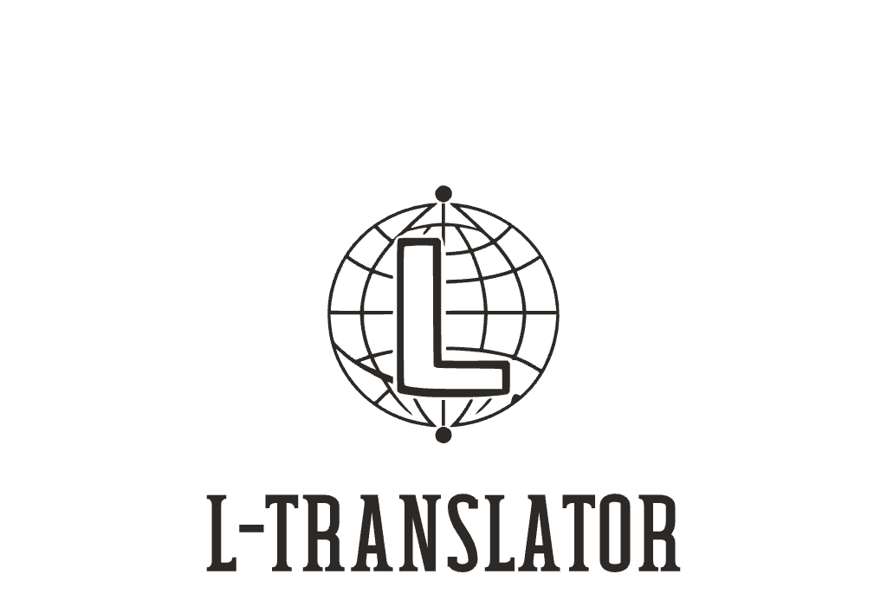

# L-Translator - 轻量、快速、安全的本地翻译体验

<!-- <div align="center">
    
</div> -->

## ✨ 特性

- 🔒 **本地优先**: 使用本地 AI 模型进行翻译，保护您的隐私
- ⚡️ **即时翻译**: 划词即译，无需等待
- 🎯 **智能检测**: 自动识别源语言，智能选择目标语言
- 🔊 **语音朗读**: 支持文本朗读，帮助语言学习
- 🎨 **优雅界面**: 简洁美观的翻译卡片设计

## 🚀 快速开始

1. 从 Chrome 应用商店安装 L-Translator 扩展
2. 选择任意网页文本
3. 自动显示翻译结果，或点击工具栏图标手动触发

## 💡 使用提示

- 划词后自动翻译（可在设置中开启/关闭）
- 点击音频图标收听原文发音
- 支持手动选择源语言和目标语言
- 可保存常用翻译结果作为生词本

## 🛠️ 开发者指南

本项目基于 [Plasmo](https://docs.plasmo.com/) 框架开发。

```bash
# 安装依赖
pnpm install

# 开发模式
pnpm dev

# 构建产品版本
pnpm build

# 打包发布
pnpm package
```

## 📝 开源协议

[MIT License](LICENSE)

---

<div align="center">
    <sub>Made with ❤️ for language learners and translators</sub>
</div>
